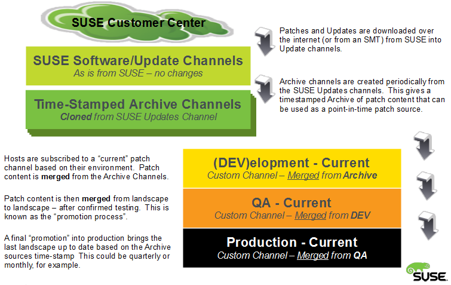
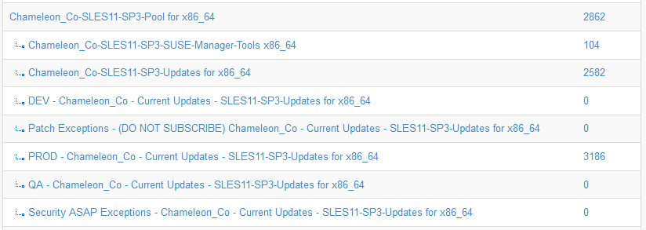

class: center, middle

# SUSE Manager: Conceptos y Ciclo de Vida de Patching
---

# Agenda

1. Introducción
2. Concepto: Patches
3. Concepto: Channels
4. Concepto: Repository
5. Concepto: System Groups y System sets
6. Concepto: Bootstrap script
7. Concepto: Activation Key
8. Concepto: SUSE Customer Center (SCC)
9. Concepto: Subscription Matching
10. Workflow de patching por cuatrimestres

---

# Introducción

[SUSE Manager](https://www.suse.com/products/suse-manager/) es un software que permite distribuir patches a diferentes sistemas operativos Linux y también el provisioning de estos sistemas, entre otras funcionalidades.

Es una extensión de SUSE Linux Enterprise 12 y 15.

---

# Patches

Es una conjunto de metadata y uno o más paquetes RPMs que contienen updates que pueden ser aplicados a un sistema. La metadata puede ser fecha de emisión, tipo de patch, versión del sistema al que aplica, etc.

Existen tres tipos de patches:

1. Bugfix Patch: arregla un problema de funcionalidad.
2. Enhancement Patch: introduce una mejora.
3. Security Patch: arregla un problema de seguridad solamente.

Para ver la documentación hacer click [aquí](https://www.suse.com/documentation/suse-manager-3/3.2/susemanager-reference/html/book.suma.reference.manual/ref.webui.patches.html).

---

# Channels

Un canal de software agrupa paquetes o patches para su distribución. La agrupación en general es por producto (SLES 12 SP3 o SLES 15 SP1, por ejemplo).

Los sistemas clientes se suscriben a dichos canales para recibir su contenido. El proceso de suscripción puede ser mediante un _bootstrap script_ o configuración de su cliente de _Salt_. La asociación entre sistema y canal la da una _subscription key_.

Existen dos tipos de canales:

1. Base channels: Consiste de paquetes armados para una arquitectura y release específicos. Ejemplo: SLES 15 SP1 x86_64.
2. Child channels: Es un canal asociado a un _base channel_ que provee paquetes extras. Ejemplo: provee patches.

Para más información ver [Channels](https://www.suse.com/documentation/suse-manager-3/3.2/susemanager-reference/html/book.suma.reference.manual/ref.webui.channels.html#ref.webui.channels.software).

---

# Repository

Un repositorio contiene paquetes o patches y está asociado a uno o más canales.

Un canal debe tener al menos un repositorio asociado para poder distribuir software a sus clientes.

Los clientes se suscriben al canal, no al repositorio.

Para más información hacer click [aquí](https://www.suse.com/documentation/suse-manager-3/3.2/susemanager-reference/html/book.suma.reference.manual/ref.webui.channels.html#s4-chnlmgmt-cdetails-repos).

---

# System Groups y System Sets

Los sistemas clientes de SUSE Manager pueden ser agrupados en [_system groups_](https://www.suse.com/documentation/suse-manager-3/3.2/susemanager-reference/html/book.suma.reference.manual/ref.webui.systems.systems.html#ref.webui.systems.systemgroups) para su mejor gestión.

Un sistema puede ser asociado a un grupo durante el proceso de bootstrap con una _subscription key_ o manualmente.

Un [_system set_](https://www.suse.com/documentation/suse-manager-3/3.2/susemanager-reference/html/book.suma.reference.manual/ref.webui.systems.systems.html#ref.webui.systems.ssm) es un grupo temporal de sistemas sobre los que se desea trabajar.

---

# Bootstrap Script

Un _bootstrap script_ es un script que permite registrar un sistema cliente con SUSE Manager.

Existen dos métodos de gestión de clientes por parte de SUSE Manager:

1. _Salt_: Utiliza el [_framework salt_](https://www.suse.com/documentation/suse-manager-3/3.2/susemanager-getting-started/html/book.suma.getting-started/salt.gs.guide.introduction.html) para la gestión del cliente.
2. _Tradicional_: Utiliza un servicio llamado [_rhnd_](https://www.suse.com/documentation/suse-manager-3/3.2/susemanager-best-practices/html/book.suma.best.practices/bp.systems.management.html#bp.contact.methods.rhnsd) o [_osad_](https://www.suse.com/documentation/suse-manager-3/3.2/susemanager-best-practices/html/book.suma.best.practices/bp.systems.management.html#bp.contact.methods.osad) para comunicarse con el cliente.

Un cliente _salt_ también puede ser registrado desde la interfaz web de SUSE Manager sin necesidad de contar con un _bootstrap script_.

Referencia de [bootstrapping](https://www.suse.com/documentation/suse-manager-3/3.2/susemanager-getting-started/html/book.suma.getting-started/preparing.and.registering.clients.html).

---

# Activation Key

Un [_activation key_](https://www.suse.com/documentation/suse-manager-3/3.2/susemanager-best-practices/html/book.suma.best.practices/bp.key.managment.html) es un conjunto de settings de configuración asociados a un label (etiqueta).

Para utilizar el _activation key_ su label se puede asociar a un _bootstrap script_ mediante un parámetro de configuración de dicho script.

---

# SUSE Customer Center (SCC)

El [_SUSE Customer Center_](https://scc.suse.com) es un sitio web que mantiene una colección de repositorios que contienen paquetes y updates para todos los sistemas soportados por SUSE.

SUSE Manager se sincroniza con el SCC para recibir sus canales con software para los sistemas soportados. Se utiliza una clave de organización asociada a la cuenta de un cliente que contiene las suscripciones que permiten la descarga de los productos licenciados.

El procedimiento de para sincronizar SUSE Manager con el SCC se encuentra [aquí](https://www.suse.com/documentation/suse-manager-3/3.2/susemanager-getting-started/html/book.suma.getting-started/suma.setup.with.yast.html#quickstart.first.channel.sync).

---

# Subscription Matching

El objetivo de la herramienta [_subscription matching_](https://www.suse.com/documentation/suse-manager-3/3.2/susemanager-reference/html/book.suma.reference.manual/ref.webui.audit.html#ref.webui.audit.subscription) es brindar una cobertura visual del uso actual de suscripciones adquiridas.

---

# Workflow de patching por cuatrimestres

El siguiente es un escenario basado en el documento [Advanced Patch Lifecycle Management with SUSE Manager](https://www.suse.com/documentation/suse-best-practices/susemanager/data/susemanager.html).

---

# Workflow de patching por cuatrimestres (cont.)

---

class: center, middle

# Preguntas

## (fin)

https://gpoppino.github.io/suma_presentation/
